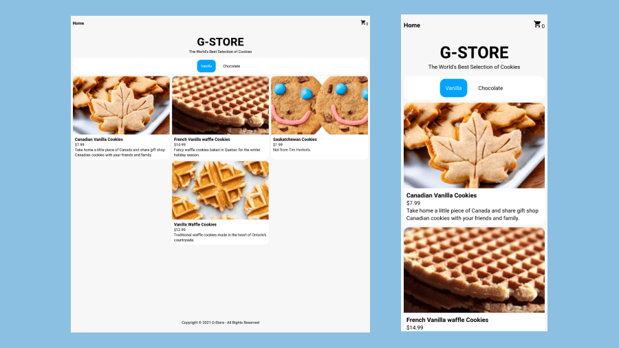

[![Contributors][contributors-shield]][contributors-url]
[![Forks][forks-shield]][forks-url]
[![Stargazers][stars-shield]][stars-url]
[![Issues][issues-shield]][issues-url]
[![MIT License][license-shield]][license-url]
[![LinkedIn][linkedin-shield]][linkedin-url]

<br />
<div align="center">
  <h3 align="center">G-Store API</h3>
  <p align="center">
    G-Store is an online store that sells cookies for my portfolio
    <br />
    <a href="https://g-store.griffindow.com">View Website</a>
    ·
    <a href="https://github.com/griffinodow/gstore-api/issues">Report Bug</a>
  </p>
</div>

<!-- ABOUT THE PROJECT -->
## About The Project


This is the back-end REST API of an online cookie store for my portfolio. Select a specified quanity of products to insert into a cart for purchasing. Then input test payment details to make a purchase.

### Features
- Communicate with Stripe CMS API
- Communicate with Stripe Payments API
- REST API for serving product catalog
- REST API for creating orders
- REST API for paying for orders

### Ambition

The goal of this project was to communicate with an external CMS and payment processing system while using REST API paradigms.

### Built With

* [TypeScript](https://www.typescriptlang.org/)
* [Node.js](https://nodejs.org/)
* [Express.js](https://expressjs.com/)
* [SquareSDK](https://squareup.com/ca/en)
* [Docker](https://www.docker.com/)

<!-- GETTING STARTED -->
## Getting Started
### View Demo Site

[g-store.griffindow.com](https://g-store.griffindow.com/)

### Environment Variables
For easy configuration the app expects the follow environment variable to be set for configuration. Environment variables can be passed to Docker with the -e flag.
| Entry | Environment Variable |
| --- | --- |
| Square Access Token | GS_SQUARE_ACCESS_TOKEN |

### Develop Locally

```bash
# Serve with hot reload at localhost:3000
npm run dev

# Build for production
npm run build
```

### Deploy Container

Deploy the back-end micro-service container with the following command.

```bash
docker run -p 4000:4000 -e $GS_SQUARE_ACCESS_TOKEN griffinodow/gstore-api
```

This will allow the app to be served at: http://localhost:4000

<!-- MARKDOWN LINKS & IMAGES -->
<!-- https://www.markdownguide.org/basic-syntax/#reference-style-links -->
[contributors-shield]: https://img.shields.io/github/contributors/griffinodow/gstore-api.svg?style=for-the-badge
[contributors-url]: https://github.com/griffinodow/gstore-api/graphs/contributors
[forks-shield]: https://img.shields.io/github/forks/griffinodow/gstore-api.svg?style=for-the-badge
[forks-url]: https://github.com/griffinodow/gstore-api/network/members
[stars-shield]: https://img.shields.io/github/stars/griffinodow/gstore-api.svg?style=for-the-badge
[stars-url]: https://github.com/griffinodow/gstore-api/stargazers
[issues-shield]: https://img.shields.io/github/issues/griffinodow/gstore-api.svg?style=for-the-badge
[issues-url]: https://github.com/griffinodow/gstore-api/issues
[license-shield]: https://img.shields.io/github/license/griffinodow/gstore-api.svg?style=for-the-badge
[license-url]: https://github.com/griffinodow/gstore-api/blob/master/LICENSE
[linkedin-shield]: https://img.shields.io/badge/-LinkedIn-black.svg?style=for-the-badge&logo=linkedin&colorB=555
[linkedin-url]: https://linkedin.com/in/griffinodow